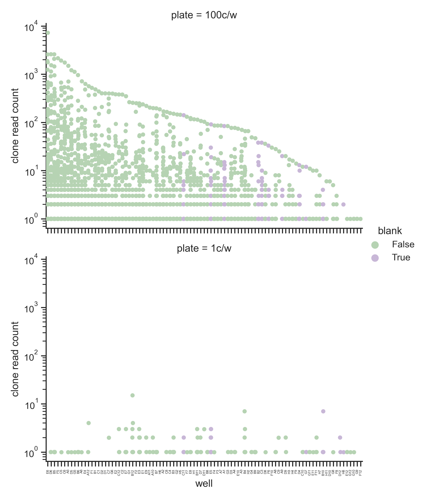
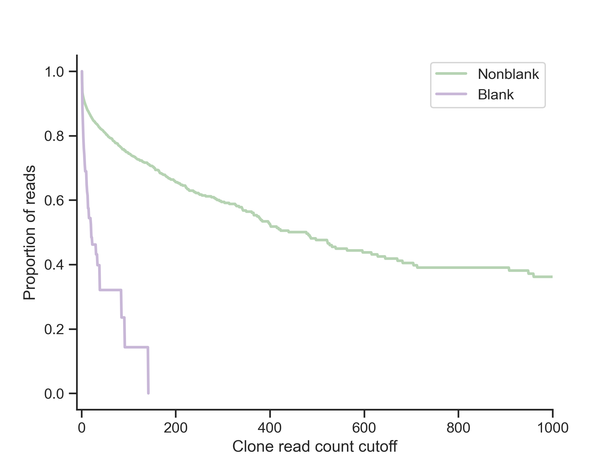
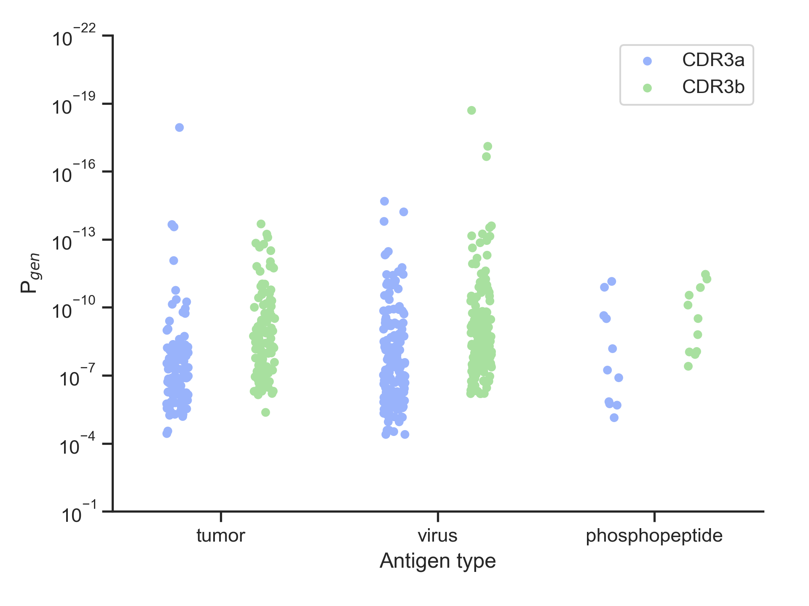

# antigenReceptorRepertoires
Analysis of bulk and single-cell TCR and BCR libraries

## Requirements
- [MiGEC](https://migec.readthedocs.io/en/latest/index.html)
- [MiXCR](https://github.com/milaboratory/mixcr)
- [VDJtools](https://vdjtools-doc.readthedocs.io/en/master/#)
- [OLGA](https://github.com/statbiophys/OLGA)

## Manifest
`TCR_demultiplex.sh`, `BCR_demultiplex.sh`: use MiGEC and MiXCR to demultiplex paired-end reads from Illumina sequencing and align TCRs or BCRs.

`readStats.py`: Determines for single-cell plateseq experiment, such as FACS-sorted single cells, the clonal read count per well.

`blankProportion.py`: determines the proportion of blank reads as a function of clone read count. Useful for determining the optimal read count cutoff.

`CDRcounts.py`: Count CDR3 occurrence

`pgen.py`: Determine generation probability of CDR3a and CDR3b for a list of TCRs

